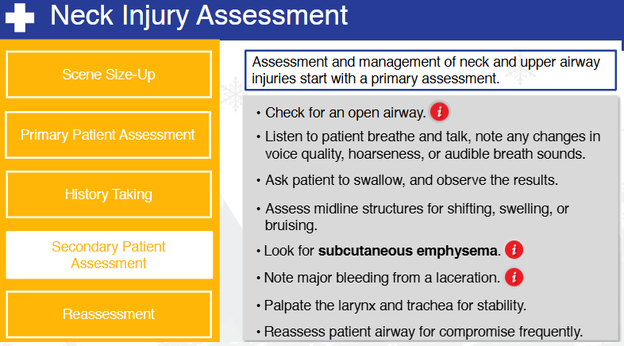
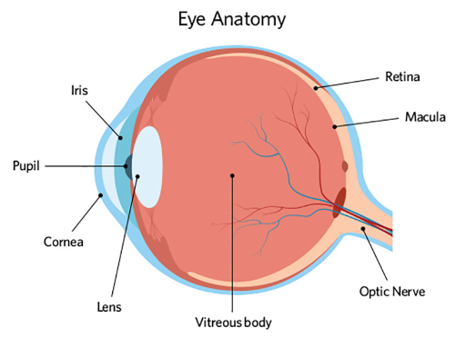
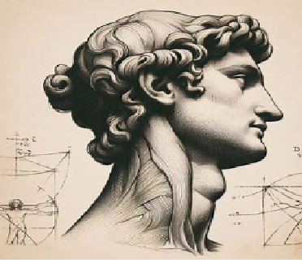

# Nsp Oec Training Chapter 22 - National Ski Patrol - Outdoor Emergency Care chapter 22
National Ski Patrol - Outdoor Emergency Care chapter 22

## Chapter 22: Face, Eye, and Neck Injuries

1. Describe the function of the eye.
2. Describe the assessment and management of ear injuries.
3. Describe and demonstrate the management of a patient with a penetrating injury to the eyeball.
4. Identify the important structures of the anterior neck.
5. List the signs and symptoms of traumatic injury emergencies of the neck and upper airway.
6. Describe the function of the lacrimal glands.
7. Describe the management of a dental injury.
8. List the signs and symptoms of emergent injuries to the face, eyes, and neck.
9. Describe and demonstrate how to assess face, eye, and neck injuries.
10. Describe and demonstrate the proper care of a face, eye, or anterior neck injury.

## 22.1 Describe the function of the eye.

The **eye** is a highly specialized sensory organ responsible for **vision**, allowing humans to perceive light, shapes, colors, and depth. Its main function is to convert light into electrical signals that the brain can interpret, enabling us to see the world around us. Here's a breakdown of the **functions of the eye** and its key structures:

### 1. **Cornea**:
   - The **clear, dome-shaped outer layer** at the front of the eye that helps focus light onto the retina.
   - It provides the majority of the eye’s refractive power, bending light as it enters the eye to help direct it toward the lens.

### 2. **Pupil and Iris**:
   - The **pupil** is the black circular opening in the center of the eye through which light enters.
   - The **iris** is the colored part of the eye that surrounds the pupil and controls the amount of light entering the eye by adjusting the size of the pupil.
     - In bright light, the pupil constricts (gets smaller) to reduce the amount of light entering.
     - In dim light, the pupil dilates (gets larger) to allow more light in.

### 3. **Lens**:
   - Located just behind the iris and pupil, the **lens** further focuses light onto the retina.
   - The lens can **change shape** (becoming thicker or thinner) to adjust focus for objects at different distances—a process called **accommodation**.

### 4. **Retina**:
   - The **retina** is the light-sensitive layer of tissue at the back of the eye that contains specialized cells called **photoreceptors** (rods and cones).
     - **Rods** are responsible for vision in low light and peripheral vision.
     - **Cones** are responsible for color vision and seeing in bright light.
   - The retina converts incoming light into **electrical signals** that are sent to the brain for interpretation.

### 5. **Optic Nerve**:
   - The **optic nerve** is the nerve that transmits electrical signals from the retina to the brain.
   - It acts as the connection between the eye and the **visual cortex** of the brain, where the signals are processed into images.

### 6. **Sclera**:
   - The **sclera** is the white, tough outer layer of the eye that provides structure and protection to the inner components of the eye.

### 7. **Vitreous Humor**:
   - The **vitreous humor** is a clear, gel-like substance that fills the space between the lens and the retina. It helps the eye maintain its round shape and allows light to pass through to the retina.

### 8. **Macula and Fovea**:
   - The **macula** is a small, central area of the retina responsible for **central vision**, which allows us to see fine details.
   - The **fovea**, located in the center of the macula, is responsible for **sharp, detailed vision** and contains the highest concentration of cones.

---

### **Summary of Eye Function**:
The eye's primary function is to capture light and convert it into signals that the brain can interpret. Here's how it works in a simplified process:
1. **Light enters** the eye through the **cornea** and passes through the **pupil**.
2. The **iris** adjusts the pupil size based on the amount of light.
3. The **lens** further focuses the light onto the **retina**.
4. The **retina** converts light into electrical signals using **photoreceptors** (rods and cones).
5. The **optic nerve** transmits these signals to the brain, where the **visual cortex** processes them into images, allowing us to see.

The eye works like a camera, focusing light onto a receptive surface (the retina) and converting this light into a visual representation that the brain can understand.

## 22.2 Describe the assessment and management of ear injuries.

### **Assessment and Management of Ear Injuries**

Ear injuries can vary in severity, ranging from minor external trauma to more serious internal injuries that may affect hearing and balance. Proper assessment and management are crucial to prevent complications and preserve ear function.

### **1. Assessment of Ear Injuries**

#### **a. Patient History**
   - **Ask about the mechanism of injury**: Determine how the injury occurred (e.g., blunt trauma, penetrating injury, loud noise exposure, or barotrauma from pressure changes).
   - **Gather symptoms**: Ask the patient if they are experiencing pain, hearing loss, ringing in the ears (tinnitus), dizziness, or discharge from the ear.
   - **Medical history**: Inquire about pre-existing ear conditions (e.g., hearing loss, infections, or surgeries).

#### **b. Physical Examination**
   - **Inspect the outer ear (pinna)**:
     - Look for visible signs of trauma (e.g., cuts, bruises, swelling, or deformities).
     - Check for signs of **hematoma** (e.g., auricular hematoma), which may need urgent drainage to prevent complications like cauliflower ear.
   
   - **Examine the ear canal**:
     - Use an **otoscope** to look into the ear canal for any foreign objects, lacerations, swelling, or signs of infection.
     - Check for blood, pus, or **clear fluid discharge** (could indicate a ruptured eardrum or cerebrospinal fluid leakage in more severe cases).

   - **Assess the eardrum (tympanic membrane)**:
     - Check for signs of **perforation**, which may present as a visible hole or tear in the eardrum, or **retracted**/**bulging membranes**, indicating possible infection or trauma.
     - **Discharge** from the ear may indicate a ruptured eardrum, especially if it is blood or fluid (which could indicate a basal skull fracture).

   - **Assess hearing and balance**:
     - Conduct a basic **hearing assessment** (e.g., whisper test, finger rub) to check for any hearing loss.
     - **Ask about dizziness or vertigo**, as inner ear injuries can affect the balance organs.
   
   - **Palpate for tenderness**:
     - Palpate around the ear, jaw, and neck to check for tenderness, swelling, or signs of fractures.

---

### **2. Management of Ear Injuries**

#### **a. Minor External Ear Injuries**
   - **Lacerations or cuts**:
     - Clean the area gently with sterile saline or water.
     - Apply a sterile dressing or bandage to prevent infection.
     - Small cuts may heal on their own, while deeper lacerations may require **suturing** by a healthcare provider.
   - **Auricular hematoma**:
     - Drain the hematoma immediately or refer the patient for surgical drainage to prevent **cauliflower ear** (permanent deformity).
     - Apply a compressive dressing after drainage to prevent re-accumulation of blood.

#### **b. Ear Canal Injuries**
   - **Foreign body in the ear canal**:
     - Do not attempt to remove the object if it is embedded deeply or if the patient is in pain.
     - Refer the patient to a healthcare provider or **ENT specialist** for safe removal.
   - **Ear infections**:
     - If there are signs of infection (pain, discharge), treat with **topical or systemic antibiotics**, depending on the severity.
     - Avoid ear drops if the **eardrum is perforated** (a physician may prescribe appropriate treatment after examination).

#### **c. Eardrum (Tympanic Membrane) Injuries**
   - **Perforated eardrum**:
     - Most perforations will heal spontaneously without surgical intervention.
     - Advise the patient to avoid **inserting anything into the ear** (e.g., cotton swabs) and to keep the ear dry.
     - Avoid using ear drops unless prescribed by a healthcare provider.
     - If the injury is due to **loud noise or barotrauma**, monitor for signs of hearing loss or dizziness.
     - **Referral**: Patients with significant hearing loss, recurrent infections, or non-healing perforations should be referred to an **ENT specialist** for further evaluation and possible **surgical repair** (e.g., tympanoplasty).

#### **d. Inner Ear Injuries**
   - **Hearing loss and tinnitus**:
     - Assess and monitor for any sudden or gradual hearing loss.
     - Refer patients with significant or persistent **hearing loss** or **tinnitus** to an **audiologist** or **ENT specialist** for further testing (e.g., audiometry).
   - **Balance issues (vertigo)**:
     - Inner ear injuries affecting the **vestibular system** can cause dizziness or vertigo.
     - Treat symptoms with **antivertigo medications** (e.g., meclizine) and advise the patient to avoid sudden movements.
     - Refer to an ENT specialist if symptoms persist.

#### **e. Severe Trauma (Blunt or Penetrating)**
   - **Severe external trauma**:
     - Stabilize any **severe injuries**, such as skull fractures, and manage bleeding.
     - Apply a **sterile dressing** and refer the patient for immediate **emergency medical care**.
   - **Cerebrospinal fluid (CSF) leakage**:
     - If **clear fluid** is draining from the ear after trauma, suspect a **basal skull fracture**.
     - **DO NOT** pack the ear or attempt to stop the drainage; this requires urgent evaluation by a healthcare provider.
     - Transport the patient for **emergency imaging** (e.g., CT scan) to assess for skull fractures.

---

### **Summary of Key Management Steps**:
- **Minor injuries**: Clean, dress, and monitor.
- **Foreign bodies**: Remove carefully, or refer for specialist removal.
- **Perforated eardrum**: Keep dry, avoid inserting objects into the ear, and monitor for healing.
- **Hematomas**: Drain to prevent deformity.
- **Severe injuries**: Manage bleeding, stabilize, and seek urgent care.

### **Referral and Follow-up**:
- Patients with ongoing symptoms such as **hearing loss, dizziness, persistent discharge, or non-healing perforations** should be referred to an **ENT specialist** for further evaluation and treatment.

## 22.3 Describe and demonstrate the management of a patient with a penetrating injury to the eyeball.

Managing a patient with a **penetrating injury to the eyeball** requires extreme care to prevent further damage, preserve vision, and minimize the risk of infection. Eye injuries of this type are considered medical emergencies and need immediate attention. Here's how to **manage** a patient with a penetrating eye injury.

---

### **Steps to Manage a Penetrating Injury to the Eye:**

### 1. **Ensure Scene Safety**
   - Ensure that the scene is safe for both the patient and responders. Stabilize the environment to prevent further injury.

### 2. **Do Not Remove the Object**
   - **Do not attempt to remove** the penetrating object from the eye. Removing it can cause further damage or severe bleeding.
   - The object may be applying pressure that prevents more severe internal damage or hemorrhaging, so it should remain in place until a specialist can safely remove it.

### 3. **Reassure and Calm the Patient**
   - Keep the patient calm and as still as possible to avoid any movement that could worsen the injury.
   - Advise the patient to avoid **moving their eye**, blinking excessively, or rubbing the injured eye.

### 4. **Cover the Injured Eye (Stabilization)**
   - The goal is to stabilize the object and **protect the injured eye** from further harm.
   - **Create a protective shield**:
     - If the object is protruding from the eye, stabilize it using a **rigid shield** or a **cup** (like a paper cup or eye shield).
     - The shield or cup should not touch the object but be placed over it to protect it from movement.
     - Secure the shield or cup with **tape** without applying pressure on the eye or the object itself.
   - **Avoid direct pressure**: Do not apply pressure to the eye or surrounding areas to avoid increasing intraocular pressure or causing further injury.

### 5. **Cover the Uninjured Eye**
   - Covering both eyes helps prevent **movement of the injured eye**. When one eye moves, the other moves as well, so covering the uninjured eye helps reduce involuntary eye movement.
   - Use a **light dressing** (such as a sterile pad or gauze) to gently cover the uninjured eye, securing it lightly with tape or a bandage.

### 6. **Position the Patient**
   - If possible, keep the patient in a **semi-reclined** or **sitting position** with the head elevated. This helps reduce intraocular pressure and minimizes the risk of further injury.
   - Advise the patient to keep their head still during transport.

### 7. **Avoid Food or Drink**
   - Do not allow the patient to eat or drink anything, as they may require surgery, and anesthesia may be necessary.

### 8. **Monitor and Provide Reassurance**
   - Continuously monitor the patient's **vital signs** and provide emotional reassurance to keep them calm.
   - Keep the patient as still and relaxed as possible to prevent any additional trauma to the eye.

### 9. **Transport the Patient to Emergency Care**
   - **Activate emergency medical services (EMS)** immediately. Penetrating eye injuries require urgent evaluation by an **ophthalmologist** or trauma specialist in an emergency room or trauma center.
   - Ensure the patient is transported carefully, with ongoing stabilization of the eye and the object.

### 10. **Prevent Further Contamination or Infection**
   - Avoid touching the injured eye or the object, as this can introduce bacteria and increase the risk of infection.
   - If possible, use **sterile dressings** to cover the shield or eye to help minimize contamination.

---

### **Demonstration of Proper Management**:

1. **Stabilize the Object**:
   - For example, if a pencil is protruding from the eye, place a **paper cup** or rigid object over the pencil without pressing on it. Secure it with tape to avoid movement during transport.

2. **Cover Both Eyes**:
   - Gently cover the **uninjured eye** with a sterile pad or gauze. This prevents the patient from moving their injured eye involuntarily.

3. **Position the Patient**:
   - If conscious, keep the patient in a **sitting or semi-reclined** position, instructing them to stay as still as possible.

4. **Ensure Transport**:
   - While waiting for emergency responders, continue to reassure the patient, check their **vital signs**, and be prepared to provide additional care if needed.

---

### **Do’s and Don’ts in Penetrating Eye Injury Management**:

- **Do**:
   - Stabilize the object.
   - Cover both eyes to limit eye movement.
   - Keep the patient calm and still.
   - Transport the patient urgently to medical care.

- **Don’t**:
   - **Do not** remove the penetrating object.
   - **Do not** apply pressure directly to the injured eye.
   - **Do not** allow the patient to eat or drink.

---

### **Summary**:
Proper management of a **penetrating eye injury** involves stabilizing the object, protecting both the injured and uninjured eye, keeping the patient calm, and transporting them for emergency medical treatment. These steps help prevent further injury and increase the chances of preserving vision.

## 22.4 Identify the important structures of the anterior neck.

The **anterior neck** contains several important anatomical structures that are involved in breathing, swallowing, circulation, and nerve function. These structures include muscles, blood vessels, nerves, glands, and the airway. Here is a breakdown of the key **structures of the anterior neck**:

### 1. **Hyoid Bone**
   - The **hyoid bone** is a small, U-shaped bone located at the base of the tongue, just above the larynx. It serves as an attachment site for muscles involved in swallowing and speech and is unique because it does not articulate with any other bones.

### 2. **Thyroid Cartilage**
   - The **thyroid cartilage** forms the **Adam’s apple** and is the largest cartilage of the larynx. It protects the vocal cords and the larynx.
   - The **laryngeal prominence** (commonly referred to as the Adam's apple) is more pronounced in males due to hormonal influences during puberty.

### 3. **Cricoid Cartilage**
   - Located just below the thyroid cartilage, the **cricoid cartilage** forms a complete ring around the trachea. It is the only complete ring of cartilage in the airway and provides structural support to keep the airway open.
   - This is also a key landmark for performing procedures like **cricothyroidotomy** in emergency airway management.

### 4. **Trachea (Windpipe)**
   - The **trachea** is the airway that runs from the larynx down to the bronchi. It is a cartilaginous tube that carries air to and from the lungs.
   - The trachea is located centrally and is protected by a series of C-shaped cartilage rings.

### 5. **Thyroid Gland**
   - The **thyroid gland** is a butterfly-shaped endocrine gland located just below the cricoid cartilage, in front of the trachea. It consists of two lobes connected by a central **isthmus**.
   - The thyroid produces hormones (such as **thyroxine (T4)** and **triiodothyronine (T3)**) that regulate metabolism, growth, and development.

### 6. **Parathyroid Glands**
   - The **parathyroid glands** are small, pea-sized glands located on the posterior surface of the thyroid gland. There are typically four parathyroid glands, and they secrete **parathyroid hormone (PTH)**, which helps regulate calcium levels in the blood.

### 7. **Carotid Arteries**
   - The **common carotid arteries** are located on each side of the neck and divide into the **internal** and **external carotid arteries**.
     - **Internal carotid artery**: Supplies blood to the brain.
     - **External carotid artery**: Supplies blood to the face and neck.
   - The **carotid pulse** can be palpated by pressing lightly against the carotid artery on either side of the neck.

### 8. **Jugular Veins**
   - The **internal jugular veins** and **external jugular veins** drain deoxygenated blood from the brain, face, and neck and return it to the heart.
     - **Internal jugular vein**: Runs alongside the carotid artery and drains blood from the brain.
     - **External jugular vein**: Located more superficially, it drains blood from the scalp and face.

### 9. **Vagus Nerve (Cranial Nerve X)**
   - The **vagus nerve** runs along the neck within the carotid sheath and controls parasympathetic functions in the heart, lungs, and digestive tract. It also innervates structures of the larynx and pharynx, playing a role in voice, swallowing, and reflexes like coughing.

### 10. **Sternocleidomastoid Muscle**
   - The **sternocleidomastoid** is a large muscle that runs diagonally across the sides of the neck from the **mastoid process** (behind the ear) to the **sternum** and **clavicle**.
   - It is responsible for turning and flexing the head.

### 11. **Anterior Jugular Vein**
   - The **anterior jugular vein** is located in the midline of the neck, more superficial than the internal and external jugular veins. It helps drain blood from the submental region (under the chin) and lower parts of the face.

### 12. **Esophagus**
   - The **esophagus** is the muscular tube that lies behind the trachea and carries food and liquid from the throat to the stomach. It plays a key role in swallowing.

### 13. **Lymph Nodes**
   - The anterior neck contains numerous **lymph nodes**, which are part of the immune system. These nodes filter lymphatic fluid and can become enlarged or tender in response to infection or disease.
     - **Cervical lymph nodes** are found along the sides of the neck, near the carotid arteries and jugular veins.

---

### **Summary of Key Structures in the Anterior Neck**:
1. **Hyoid Bone**: Supports muscles involved in swallowing.
2. **Thyroid Cartilage**: Forms the Adam's apple and protects the vocal cords.
3. **Cricoid Cartilage**: Provides support to the airway.
4. **Trachea**: Carries air to and from the lungs.
5. **Thyroid Gland**: Regulates metabolism via hormone production.
6. **Parathyroid Glands**: Regulate calcium levels.
7. **Carotid Arteries**: Supply blood to the brain and face.
8. **Jugular Veins**: Drain blood from the brain and face.
9. **Vagus Nerve**: Controls autonomic functions and innervates parts of the throat.
10. **Sternocleidomastoid Muscle**: Responsible for head movement.
11. **Anterior Jugular Vein**: Drains blood from the lower face.
12. **Esophagus**: Carries food and liquid to the stomach.
13. **Lymph Nodes**: Part of the immune system, filtering lymph fluid.

These structures are critical for functions such as breathing, swallowing, blood circulation, and speech.

## 22.5 List the signs and symptoms of traumatic injury emergencies of the neck and upper airway.

Traumatic injuries to the neck and upper airway can be life-threatening due to the risk of airway obstruction, damage to vital blood vessels, and spinal cord injury. Recognizing the **signs and symptoms** of these injuries early is critical for appropriate and timely intervention. Below is a list of the common signs and symptoms associated with traumatic injuries to the **neck** and **upper airway**:

---

### **Signs and Symptoms of Traumatic Neck Injuries**:

1. **Pain and Tenderness**:
   - **Neck pain** at the site of injury.
   - **Tenderness** when palpating the neck, especially over bones like the cervical spine.

2. **Swelling or Bruising**:
   - **Swelling** around the neck, which may indicate damage to soft tissues or underlying structures.
   - **Bruising** may be present, especially if major blood vessels like the jugular veins or carotid arteries are involved.

3. **Bleeding**:
   - **External bleeding** from a penetrating wound or laceration to the neck.
   - **Internal bleeding** may cause visible swelling or **hematomas** in the neck area.

4. **Subcutaneous Emphysema (Crepitus)**:
   - **Air trapped under the skin** may cause a crackling sensation upon palpation. This can occur with damage to the airway (trachea, larynx) or esophagus.

5. **Hoarseness or Loss of Voice**:
   - Damage to the **larynx** or vocal cords can result in **hoarseness**, **difficulty speaking**, or a complete loss of voice.
   - This is often an indication of trauma to the **larynx** or vagus nerve.

6. **Difficulty Breathing (Dyspnea)**:
   - **Shortness of breath** or labored breathing, which can indicate airway obstruction, swelling, or damage to the trachea.
   - **Stridor**: A high-pitched, wheezing sound during breathing that suggests an upper airway obstruction.

7. **Hemoptysis (Coughing up Blood)**:
   - **Coughing up blood** may indicate trauma to the airway, lungs, or surrounding blood vessels.

8. **Difficulty Swallowing (Dysphagia)**:
   - **Painful swallowing** or an inability to swallow may indicate damage to the **esophagus** or compression from swelling or hematoma.

9. **Visible Deformity**:
   - Any visible deformity, such as **misalignment** or a step-off in the structure of the cervical spine.
   - **Tracheal deviation**: The trachea may shift to one side, indicating pressure from a collapsed lung (tension pneumothorax) or a large hematoma.

10. **Tracheal Tugging**:
   - **Abnormal movement of the trachea** during breathing can suggest airway trauma or impending airway collapse.

11. **Distended Neck Veins (Jugular Vein Distention)**:
   - **Jugular vein distention (JVD)** may indicate increased pressure in the chest (such as in **tension pneumothorax**) or injury to the **thoracic cavity**.

12. **Cyanosis**:
   - **Bluish discoloration** of the skin, lips, or nail beds due to a lack of oxygen, indicating compromised airway function or oxygen exchange.

13. **Neurological Symptoms**:
   - **Weakness**, **numbness**, or **paralysis** in the arms or legs, which may indicate a **spinal cord injury** in the cervical spine.
   - **Loss of sensation** or difficulty controlling limb movement.

14. **Shock**:
   - Symptoms of **shock** such as **pale, cool, and clammy skin**, **rapid pulse**, and **low blood pressure** can result from blood loss or injury to major blood vessels.

---

### **Specific Symptoms of Traumatic Upper Airway Injuries**:

1. **Airway Obstruction**:
   - **Partial or complete blockage** of the airway caused by swelling, blood, foreign objects, or damage to the trachea or larynx.
   - **Gurgling sounds** or difficulty speaking may indicate the airway is compromised.

2. **Stridor**:
   - A high-pitched sound heard during inspiration, which signals **upper airway obstruction** from swelling, foreign bodies, or damage to the vocal cords or trachea.

3. **Subcutaneous Air (Crepitus)**:
   - The sensation of **crackling** beneath the skin due to air leakage from the trachea or esophagus into the soft tissues (subcutaneous emphysema).

4. **Changes in Voice**:
   - A change in the voice such as **hoarseness** or loss of voice may indicate **laryngeal trauma** or damage to the vocal cords.

5. **Open Neck Wound ("Sucking" Wound)**:
   - An open wound may cause a **"sucking" sound** as air enters the wound during breathing, indicating a **penetrating injury** that involves the trachea or lungs.

6. **Hematoma Formation**:
   - Large **hematomas** can compress the airway or vascular structures, leading to difficulty breathing or swallowing.

---

### **Immediate Management Priorities**:

1. **Airway Management**:
   - Ensure the airway is open and clear. If the airway is compromised, use the **jaw-thrust maneuver** to open it while protecting the cervical spine.
   - Prepare for **advanced airway management** (e.g., endotracheal intubation or cricothyroidotomy) if the patient has a severely compromised airway.

2. **Spinal Precautions**:
   - Assume **cervical spine injury** in any trauma to the neck. **Immobilize the spine** immediately with a cervical collar and a long backboard if necessary.

3. **Control Bleeding**:
   - Apply **direct pressure** to control external bleeding. Avoid excessive pressure over penetrating injuries that involve major vessels.

4. **Stabilize Penetrating Objects**:
   - **Do not remove penetrating objects** from the neck. Instead, stabilize the object in place and ensure safe transport to the hospital for further evaluation.

5. **Monitor and Transport**:
   - Monitor **vital signs** closely, including breathing rate, pulse, and level of consciousness.
   - Transport the patient urgently to the nearest trauma center for **advanced imaging** and **surgical management** if necessary.

---

### **Conclusion**:
Traumatic injuries to the neck and upper airway can quickly become life-threatening due to airway compromise, damage to major blood vessels, or spinal cord injury. Recognizing the **signs and symptoms** of these injuries is essential for timely and appropriate management, which includes securing the airway, controlling bleeding, stabilizing the cervical spine, and transporting the patient to a trauma facility.

## 22.6 Describe the function of the lacrimal glands.

The **lacrimal glands** are responsible for producing **tears**, which play an essential role in maintaining the health and function of the eyes. These glands are located in the upper outer region of each eye, just above the lateral aspect of the eye in the bony orbit.

### **Functions of the Lacrimal Glands**:

1. **Tear Production**:
   - The primary function of the lacrimal glands is to produce **tears** (a watery fluid) that help keep the eyes **moist** and **lubricated**. This is crucial for comfort and clear vision.

2. **Protection and Cleansing**:
   - Tears contain **enzymes** (such as **lysozyme**) that help protect the eyes from infections by killing bacteria and other microorganisms.
   - Tears also **wash away debris, dust**, and irritants from the surface of the eye.

3. **Nourishment**:
   - Tears help nourish the **cornea**, the clear, front part of the eye, by delivering **oxygen** and **nutrients**. Since the cornea does not have its own blood supply, tears are essential for its health.

4. **Maintaining a Smooth Optical Surface**:
   - A continuous film of tears spreads over the surface of the eye, creating a smooth surface that is critical for **sharp vision**. Without this, the light entering the eye would be scattered, leading to blurred vision.

5. **Emotional Tears**:
   - In addition to basal (continuous) tear production, the lacrimal glands are also involved in producing **reflex tears** (due to irritants like smoke or foreign objects) and **emotional tears** (triggered by feelings of sadness, joy, or other emotions).

### **Tear Drainage**:
After the lacrimal glands produce tears, they are spread across the eye's surface when you blink. The tears are then drained through the **lacrimal puncta** (small openings in the inner corner of the eyelids), which lead to the **nasolacrimal duct**, where tears are carried into the nasal cavity. This is why your nose often runs when you cry.

---

### **Summary**:
The **lacrimal glands** produce tears to **lubricate**, **protect**, **nourish**, and maintain a smooth surface on the eyes, ensuring clear vision and preventing infections.

## 22.7 Describe the management of a dental injury.

Management of a **dental injury** requires timely care to reduce pain, prevent infection, and preserve the injured tooth or teeth. The management will vary based on the type and severity of the dental injury, which can range from minor chips to complete tooth displacement (avulsion). Here’s how to manage common dental injuries:

---

### **1. Tooth Fractures (Chipped, Cracked, or Broken Tooth)**

#### **Signs and Symptoms**:
- **Pain or sensitivity** when chewing or exposed to hot/cold temperatures.
- Visible **chipping** or **cracking** of the tooth.

#### **Management**:
1. **Rinse the Mouth**:
   - Have the patient **rinse their mouth** with warm water to clean the area.
   
2. **Save Tooth Fragments** (if possible):
   - If the tooth fragment is found, store it in **milk**, **saline**, or the patient's saliva to preserve it until it can be assessed by a dentist.

3. **Control Bleeding**:
   - If the injury involves **bleeding**, apply **gauze** or a clean cloth to the injured area with gentle pressure.

4. **Relieve Pain**:
   - Offer an **over-the-counter pain reliever** like ibuprofen to manage pain and inflammation (if no contraindications).
   - If the tooth is sensitive, cover the broken area with **dental wax** or a piece of sugarless gum to protect it temporarily.

5. **Dental Care**:
   - Refer the patient to a **dentist** as soon as possible. Depending on the severity, the dentist may apply bonding materials or perform other treatments to restore the tooth.

---

### **2. Tooth Avulsion (Complete Knockout)**

#### **Signs and Symptoms**:
- The tooth is **completely displaced** from its socket.
- Pain, bleeding, and **empty socket** in the gums.

#### **Management**:
1. **Find the Tooth**:
   - Locate the tooth and handle it **by the crown (top part)**, avoiding the root.

2. **Rinse the Tooth**:
   - **Rinse the tooth** gently with **saline solution** or **clean water** to remove dirt, but **do not scrub** or remove any attached tissue fragments.

3. **Reimplant the Tooth** (if possible):
   - **Reinsert the tooth** into the socket as soon as possible.
   - Gently push the tooth into place and have the patient bite down on a gauze pad to keep it in position.
   - If the tooth cannot be reinserted immediately, store it in a **container of milk**, **saline**, or **the patient’s saliva** (inside the cheek) to preserve it.

4. **Control Bleeding**:
   - Apply gentle pressure to the gum with **gauze** to control any bleeding.

5. **Seek Immediate Dental Care**:
   - Transport the patient to an **emergency dentist** or the **emergency room** as quickly as possible (ideally within 30 minutes). Timely reimplantation increases the chance of saving the tooth.

---

### **3. Tooth Luxation (Partially Dislodged or Loosened Tooth)**

#### **Signs and Symptoms**:
- The tooth is **loose**, displaced sideways, forward, or backward but still partially attached to the socket.
- Pain or discomfort when moving the tooth.

#### **Management**:
1. **Stabilize the Tooth**:
   - Have the patient **gently bite down** on a piece of **gauze** or a soft cloth to hold the tooth in its current position.

2. **Rinse the Mouth**:
   - Rinse the patient’s mouth with **warm water** to clean the area and remove debris.

3. **Control Bleeding**:
   - If there is bleeding, apply **gentle pressure** with gauze to the gum around the tooth.

4. **Seek Dental Care**:
   - Refer the patient to a **dentist** as soon as possible. The dentist may reposition the tooth and secure it with a splint, allowing the supporting structures to heal.

---

### **4. Intrusion Injury (Tooth Pushed into the Jawbone)**

#### **Signs and Symptoms**:
- The tooth appears **shorter** or **sunk into the gum**.
- Pain and potential damage to the underlying bone or nearby teeth.

#### **Management**:
1. **Do Not Attempt to Reposition**:
   - **Do not attempt to pull the tooth** back into position. Leave the tooth as it is.

2. **Control Bleeding**:
   - Apply gentle pressure with **gauze** if there is any bleeding.

3. **Seek Immediate Dental Care**:
   - The patient should be referred to a **dentist or oral surgeon** immediately. Intruded teeth often require surgical repositioning or orthodontic treatment.

---

### **5. Soft Tissue Injuries (Gums, Lips, Tongue)**

#### **Signs and Symptoms**:
- **Lacerations, cuts**, or **bruising** to the lips, gums, or tongue.
- Bleeding or swelling around the soft tissues of the mouth.

#### **Management**:
1. **Control Bleeding**:
   - Use **gauze** or a clean cloth to apply **direct pressure** to the injured area until the bleeding stops.
   - For **tongue injuries**, pull the tongue forward to apply pressure.

2. **Clean the Area**:
   - Rinse the mouth with **warm saltwater** to clean the wound and reduce the risk of infection.

3. **Cold Compress**:
   - Apply a **cold compress** to the outside of the mouth or cheek to reduce swelling.

4. **Seek Dental Care**:
   - If the bleeding persists or the wound is deep, refer the patient to a **dentist or emergency room** for further evaluation and possible suturing.

---

### **General Management Tips**:
- **Pain Management**: Over-the-counter pain relievers (e.g., ibuprofen) can help manage pain and swelling.
- **Antibiotics**: If there is a risk of infection (such as in cases of avulsion or soft tissue injury), the dentist may prescribe antibiotics.
- **Tetanus Consideration**: In cases of dental trauma involving **dirt or contamination**, ensure the patient’s **tetanus vaccination** is up to date.

---

### **Summary of Key Steps**:
1. **Rinse the mouth** with warm water to clean the area.
2. **Control bleeding** with gauze or clean cloth.
3. **Preserve the tooth** (in cases of avulsion) by placing it in milk, saline, or the patient’s saliva.
4. **Stabilize loose teeth** by biting down on gauze.
5. **Seek immediate dental care** for proper evaluation and treatment.

Proper management of a dental injury can greatly increase the chances of saving the tooth and preventing complications such as infection or chronic pain.

## 22.8 List the signs and symptoms of emergent injuries to the face, eyes, and neck.
## 22.9 Describe and demonstrate how to assess face, eye, and neck injuries.
## 22.10 Describe and demonstrate the proper care of a face, eye, or anterior neck injury.

## Getting Started
To get started with the **Nsp Oec Training Chapter 22** solution repository, follow these steps:
1. Clone the repository to your local machine.
2. Install the required dependencies listed at the top of the notebook.
3. Explore the example code provided in the repository and experiment.
4. Run the notebook and make it your own - **EASY !**
    
## Solution Features
- Easy to understand and use  
- Easily Configurable 
- Quickly start your project with pre-built templates
- Its Fast and Automated

## Notebook Features
- **Self Documenting** - Automatically identifes major steps in notebook 
- **Self Testing** - Unit Testing for each function
- **Easily Configurable** - Easily modify with **config.INI** - keyname value pairs
- **Includes Talking Code** - The code explains itself 
- **Self Logging** - Enhanced python standard logging   
- **Self Debugging** - Enhanced python standard debugging
- **Low Code** - or - No Code  - Most solutions are under 50 lines of code
- **Educational** - Includes educational dialogue and background material
    
## Deliverables or Figures
             
    

## Github    
## https://github.com/JoeEberle/ 

## Email 
## josepheberle@outlook.com 

    

    